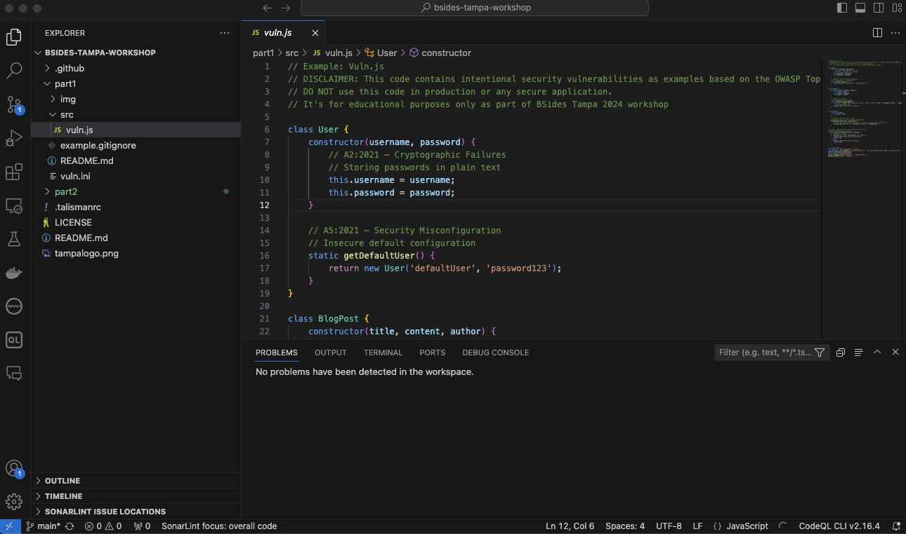

# Part 1 - Security within the Development Environment

In Part 1, we explore various technologies that can be used to improve security in the Software Development Lifecycle (SDLC) at the development environment level.

## Technologies Covered:
1. **SonarLint**: A plugin to help detect and fix issues in your IDE, including security vulnerabilities.  
   [Documentation](https://docs.sonarsource.com/sonarcloud/improving/sonarlint/)
   
2. **VSCode**: The IDE we’ll be using throughout the workshop, available as a part of GitHub Codespaces.  
   [VSCode](https://code.visualstudio.com/)

3. **SonarCloud**: A cloud-based service that integrates with SonarLint to provide additional security features.  
   [SonarCloud](https://sonarcloud.io/)

4. **GitHub**: The platform where we’ll manage our repository, pre-commit hooks, and other CI/CD activities.  
   [GitHub](https://github.com/)

5. **Talisman**: A tool for setting up pre-commit hooks to prevent secrets and other sensitive information from being committed.  
   [Talisman on GitHub](https://github.com/thoughtworks/talisman)

6. **.gitignore**: A file used to specify which files or directories should be ignored by Git, preventing accidental commits of sensitive files.  
   [gitignore Documentation](https://git-scm.com/docs/gitignore)

7. **BFG Repo Cleaner**: A tool used to clean sensitive information from your Git history.  
   [BFG Repo Cleaner](https://rtyley.github.io/bfg-repo-cleaner/)

We have provided setup scripts for using GitHub Codespaces during the workshop, which avoids the challenges of local package installations and configuration issues.

## Codespaces Setup

1. **Navigate to the repository**: In your forked repository, click the green `Code` button.
2. **Create a Codespace**: Select the `Codespaces` tab and click `Create codespace on main`.

## Module 1: IDE Integration

The first part of the workshop focuses on integrating security tools into your IDE.

### SonarLint Plugin

SonarLint is a plugin that helps detect security vulnerabilities and other code quality issues in real-time. You can install it via the SonarSource website.

- **Supported IDEs**:
   - JetBrains IDEs (e.g., IDEA, CLion, WebStorm)
   - Visual Studio
   - VS Code
   - Eclipse

During the workshop, we'll use VS Code in Codespaces.

#### Steps:
1. Install SonarLint in your VS Code IDE. [Installation Guide](https://docs.sonarsource.com/sonarcloud/improving/sonarlint/)
2. Optionally, create a SonarCloud account and link it to your GitHub account.

Once installed, SonarLint will highlight issues in your code, such as hardcoded secrets and security vulnerabilities.

### Example: Fixing Issues with SonarLint
1. Open the `vuln.ini` file in the `part1` folder.
2. SonarLint will flag issues, such as the hardcoded AWS key.
3. Fix the issues using the quick fixes provided by the plugin.



## Module 2: Pre-commit Hooks

Pre-commit hooks run scripts before code is committed to the repository, helping to prevent security vulnerabilities from being added.

### Talisman
### Talisman 

The next tool we will look at is Talisman which can be used to setup pre-commit hooks to aid in security. 

You can find it at the following GitHub repository:

https://github.com/thoughtworks/talisman

Talisman is capable of scanning git changesets to ensure secrets and other sensitive information is
not added to the repository. This includes not only AWS API Keys, but SSH keys, tokens, passwords and similar.

Install in the code space by entering:

```console
bash -c "$(curl --silent https://raw.githubusercontent.com/thoughtworks/talisman/main/install.sh)"
```

Open up the `README` file in the GitHub repository and follow the installation steps for your OS.

Once installed we can configure a stand alone pre-commit hook for our repository.

Run the following command:

```console
echo "talisman -g pre-commit" >> .git/hooks/pre-commit && chmod +x .git/hooks/pre-commit
```

The pre-commit hook will now act as a blocker to commiting secrets to the code base.

We can ignore false positives using the `.talismanrc` file. You can see an example in the root of this project. 

Here we have told it to ignore the `README` file, since it contains words that trigger a false positive.

```console
Talisman Scan: 3 / 3 <-----------------------------------------------------------------------------------------------------------------------------------------------------------> 100.00%  

Talisman Report:
+-----------------+--------------------------------+----------+
|      FILE       |             ERRORS             | SEVERITY |
+-----------------+--------------------------------+----------+
| part1/README.md | Potential secret pattern :     | low      |
|                 | not added to the repository.   |          |
|                 | This includes not only AWS API |          |
|                 | Keys, but SSH keys, tokens,    |          |
|                 | passwords and similar.         |          |
+-----------------+--------------------------------+----------+


If you are absolutely sure that you want to ignore the above files from talisman detectors, consider pasting the following format in .talismanrc file in the project root

fileignoreconfig:
- filename: part1/README.md
  checksum: 7bc8a740923be465f9f54f83fef533d0e93fa2b978350fc006d2094f2d47741d
version: ""

```

We can also ignore low severity findings, by adding the following line to our .talismanrc

```YAML

threshold: medium

```

Of course, this introduces the risk that true positives could be added to the code base. 

Talisman can also be run as a command line tool. This will scan the target directory for secrets and output a JSON file with a list of findings.

To run a scan you can type:

```console

talisman -s

``` 

The output will be added to:

```console

talisman_report/talisman_reports/data

```

Give this a try and navigate to the folder. Open the JSON file in your IDE to examine it. 

We've seen a couple of methods to catch secrets from being commited to the repository. We can also prevent whole files being added. 

Much as we saw with the `.talismanrc` file where we could configure talisman to ignore false positives, we can use a `.` file to prevent whole file types being commited to git.

To do this, we use the `.gitignore` file. Our next task will be to demonstrate how they work.


## Module 3: Preventing Accidental Commits

We can use `.gitignore` files to prevent committing sensitive or unwanted files (e.g., config files, ZIPs) to the repository.

### Steps:
1. Rename `example.gitignore` to `.gitignore` in the root directory.
2. Run the following commands:
   ```bash
   cp vuln.ini .env
   git status
   ```

   The `.env` file should be ignored, meaning it won't be tracked by Git.

## Module 4: Cleaning up Accidental Commits

If sensitive files have already been committed, you can use BFG Repo Cleaner to remove them from Git history.

### Steps:
1. Install BFG:
   ```bash
   java -jar /usr/local/bin/bfg --delete-files .env my-repo.git
   ```

2. Check the Git log to ensure the file has been removed:
   ```bash
   git log
   git show HEAD
   ```

3. Push the cleaned changes back to your repository:
   ```bash
   git push
   ```

## Conclusion

In Part 1, you’ve learned how to:
- Integrate security tools into your IDE using plugins like SonarLint.
- Set up pre-commit hooks with Talisman to prevent secrets from being committed.
- Use `.gitignore` to avoid committing sensitive files.
- Clean up accidental commits using BFG Repo Cleaner.

Now, let's take a short break before moving on to Part 2, where we will explore security in the CI/CD pipeline.

